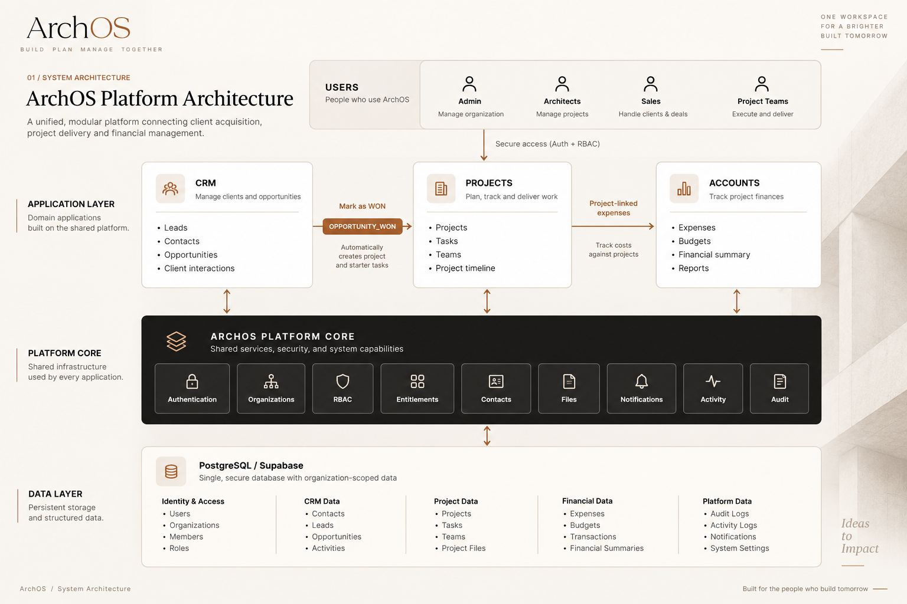

# ArchOS

ArchOS is an integrated, premium platform for architectural and design studios, providing centralized management for CRM, Projects, and Financial Accounts. It operates as a multi-tenant SaaS application with strict data isolation, role-based access control, and an event-driven architecture.

## 🚀 Features

- **Multi-Tenant Architecture**: Strict organization-level data isolation. Users can belong to multiple organizations (e.g., Acme Studio, Small Studio).
- **Advanced RBAC & App Entitlements**: Database-driven Role-Based Access Control (RBAC). Organizations configure which apps (CRM, Projects, Accounts) are accessible.
- **Premium UI/UX Shell**: A seamless Single-Page Application (SPA) shell mimicking a polished Figma-designed aesthetic, powered by Next.js Server Components.
- **Supabase Authentication**: Secure, SSR-based authentication combined directly with Prisma database roles.
- **Admin User Management**: Comprehensive invitation and approval flows. Admins can invite new users or approve pending self-signed-up users, assigning them to organizations, roles, and professions.
- **Event-Driven Workflows**: Features a cross-app Event Bus. For example, marking an Opportunity as WON in the CRM automatically creates a Project and populates it with starter Tasks.
- **Security-First Server Actions**: Robust server-side entitlement and tenant validations to prevent unauthorized data access or cross-tenant leaks.

## 🛠 Tech Stack

- **Framework**: Next.js 16 (App Router, Turbopack)
- **Database**: Prisma ORM + PostgreSQL (Supabase DB)
- **Authentication**: Supabase Auth (SSR)
- **Styling**: Tailwind CSS (Premium serif/sans-serif editorial design)
- **Language**: TypeScript (Strict mode)

## 📦 Setup & Running Locally

1. **Install Dependencies**
   `ash
   npm install
   `

2. **Configure Environment Variables**
   Create a .env or .env.local file with your Supabase credentials:
   `env
   NEXT_PUBLIC_SUPABASE_URL=your-supabase-project-url
   NEXT_PUBLIC_SUPABASE_ANON_KEY=your-supabase-anon-key
   SUPABASE_SERVICE_ROLE_KEY=your-supabase-service-role-key # Required for sending Admin invites
   `

3. **Database Setup**
   `ash
   npx prisma generate
   npx prisma db push
   `

4. **Start Development Server**
   `ash
   npm run dev
   `

## 🔐 Authentication & Onboarding Flow

ArchOS handles both Admin-led invitations and organic user signups securely:

1. **New Signup**: A user registers via Supabase Auth and verifies their email.
2. **Onboarding**: They select their profession (e.g., Architect, Interior Designer). The app permanently saves this to the database, preventing tampering.
3. **Pending State**: The user lands on a /pending route if they have no active organization memberships.
4. **Admin Approval**: An Admin uses the Users panel to assign the pending user to an organization and grants them a specific RBAC Role (like MEMBER).
5. **Session Data**: The user's active organization is tracked via an rchos_org_id cookie, which is strictly validated server-side against their database OrganizationMember status.

## 🏛 Architecture Notes

- **FigmaApp Monolith**: The primary frontend is managed within src/components/FigmaApp.tsx. It acts as an interactive client-side shell that receives heavily validated, pre-fetched serverState data from src/app/figma-actions.ts.
- **Zero-Leakage Guarantee**: Database queries (like fetching CRM Opportunities or Project Expenses) strictly enforce where: { organizationId: orgId }. Even if a user manipulates their UI state, the backend denies access if they lack the OrganizationMember relation or the organization lacks the AppEntitlement.
- **Validation**: Fully passes 
px tsc --noEmit and 
pm run lint with strict adherence to Next.js server-action and component boundaries.

